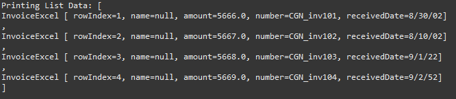

# Convert Excel data into List of java

## Method
### Firstly
__add the dependency:__  
  
`<dependency>  
  <groupId>com.github.ozlerhakan</groupId>  
  <artifactId>poiji</artifactId>  
  <version>3.1.1</version> 
</dependency>`

### Secondly 
create entity with using __jpa__ and __poiji__ annotation

## Screen Result

